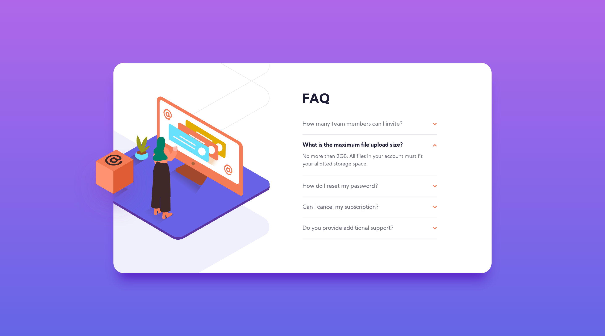
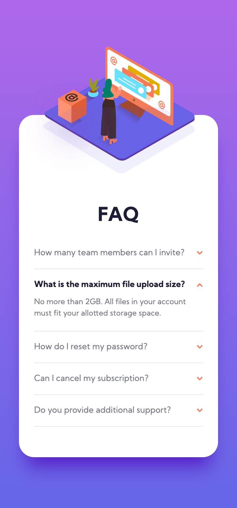

# Frontend Mentor - FAQ accordion card solution

This is a solution to the [FAQ accordion card challenge on Frontend Mentor](https://www.frontendmentor.io/challenges/faq-accordion-card-XlyjD0Oam).

## Table of contents

- [Overview](#overview)
  - [The challenge](#the-challenge)
  - [Screenshot](#screenshot)
  - [Links](#links)
- [My process](#my-process)
  - [Built with](#built-with)
  - [What I learned](#what-i-learned)
- [Author](#author)

## Overview

### The challenge

Users should be able to:

- View the optimal layout for the component depending on their device's screen size
- See hover states for all interactive elements on the page
- Hide/Show the answer to a question when the question is clicked

### Screenshot

Desktop

Mobile

### Links

- Live Site URL: [live site](https://faq-accordion-card-two.vercel.app/)

## My process

### Built with

- Semantic HTML5 markup
- CSS custom properties
- Flexbox
- Mobile-first workflow
- [React](https://reactjs.org/) - JS library
- [Styled Components](https://styled-components.com/) - For styles

### What I learned

I learned how hard it is to create even a simple layout without planning ahead! I jumped into the challenge without really thinking about how I'd tackle it and I paid for it dearly. It took me a lot longer to finish the challenge and I had to modify the styles over and over again. I won't be making this mistake again!

## Author

- Website - [Hyun Don Moon](https://velog.io/@hyundonny)
- Frontend Mentor - [@hyundonny](https://www.frontendmentor.io/profile/hyundonny)
